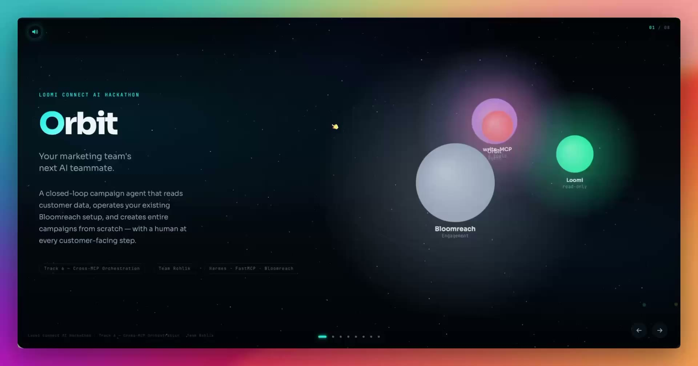

# Orbit

**Closed-loop campaign agent for lean marketing teams.** Built for the Loomi
Connect AI Hackathon (Bloomreach), Track 6 — Cross-MCP Orchestration.

An LLM agent orchestrates Bloomreach Engagement's MCP surfaces into a
**goal → context → plan → execute → monitor → iterate** loop, with a **mandatory
human-approval gate** before any campaign-facing action. The agent *recommends*;
the human *executes*. The harness is **Hermes** (agent runtime + web UI).

## Demo

[](https://drive.google.com/file/d/1LULT-8kRPxiIbpp4LDpy1gdy4wxguvYI/view?usp=share_link)

▶️ **[Watch the 5-minute demo video](https://drive.google.com/file/d/1LULT-8kRPxiIbpp4LDpy1gdy4wxguvYI/view?usp=share_link)** — full closed loop, both approval gates, and a real email send.

Prefer to step through it yourself? Open **[`demo/concept-1-orbital.html`](demo/concept-1-orbital.html)** in a browser — the interactive one-pager plays the screen-capture clips with voiceover narration, no build step.

## Architecture

```
        ┌─────────────┐   goal         ┌──────────────────────────┐
  human │  Hermes UI  │ ─────────────▶ │   Hermes agent runtime   │
   ───▶ │  (8787)     │ ◀───────────── │   (closed-loop planner)  │
        └─────────────┘  plan/approve  └────────────┬─────────────┘
            ▲  approve before any action            │
            │                          ┌────────────┴─────────────┐
            │                          │                          │
            │                  ┌───────▼────────┐      ┌──────────▼─────────┐
            │                  │ bloomreach-mcp │      │   Loomi MCP        │
            │                  │ (write, :8000) │      │ (read-only, OAuth) │
            │                  └───────┬────────┘      └──────────┬─────────┘
            └── monitor results ◀──────┴── Bloomreach Engagement ─┘
```

- **Loomi MCP** — read-only context (customers, events, analytics). Remote, OAuth.
- **bloomreach-mcp** — the write path (set properties, trigger scenarios). Custom, in-repo.
- **Human-approval gate** — no campaign-facing action runs without explicit approval.

## Why this approach

Bloomreach Engagement has no first-class agent/MCP surface for authoring and
running campaign scenarios. Two pieces close that gap:

- **Custom MCP server** (`mcp/bloomreach-engagement-mcp/`) — exposes exactly the
  Engagement endpoints the loop needs (set customer properties, trigger
  scenarios, read events/attributes) as LLM-callable tools.
- **Scenario-authoring skills** (`agent/skills/`) — the agent turns a plain
  marketing goal into a ready-to-use Bloomreach **scenario JSON**. The human
  reviews and pastes it into Engagement — that paste *is* the approval gate, and
  it's the highest degree of automation the platform allows today.

**Harness — Hermes.** Orbit doesn't build an agent from scratch. It ships a
Hermes *profile* that already wires the tools, MCP connections, skills, and
persona — enable it and it runs. Hermes is a powerful general-purpose harness
that adapts across tasks, so the work is in the tools and the loop, not the
plumbing.

**UI — open-source [hermes-webui](https://github.com/nesquena/hermes-webui)** —
chat, cron scheduling, and a Kanban board in one view. The same agent can also be
driven from Slack, Teams, Telegram, or email; the web UI is just the clearest
surface for the demo. The goal: a **minimal core with a strong harness and many
possible channels**.

## Quickstart

```bash
cp .env.example .env        # fill in credentials (see notes below)
docker compose up --build   # boots bloomreach-mcp + hermes-webui
open http://localhost:8787
```

One command brings up **two containers**:

- **`hermes-webui`** (`:8787`) — Hermes Agent **+** UI in a single container (the agent runs in-process).
- **`bloomreach-mcp`** (`:8000`) — the custom MCP server (Python).

> **LLM endpoint:** set `OPENAI_API_KEY` / `OPENAI_BASE_URL`
> to any provider you have access to. Or you can connect any LLM model or provider via "hermes model"

### Run locally (no Docker)

Run the agent directly on your machine so it operates on **this repo's real
files** (the project folder is its workspace) — useful when you want the agent
to read and edit `agent/`, scenarios, templates, etc. directly:

```bash
cp .env.example .env        # fill in credentials
./run-local.sh              # starts bloomreach-mcp (:8000) + Hermes WebUI (:8787)
open http://localhost:8787
```

`run-local.sh` creates local Python venvs, runs the MCP on `localhost:8000`,
and launches Hermes with `HERMES_HOME=./hermes/.hermes` and the workspace set to
the project root. Ctrl-C stops both. (Docker and local differ only in the MCP
URL — `BLOOMREACH_MCP_URL` — which each mode sets automatically.)

## Repo map

| Path | What it is |
| --- | --- |
| `docs/submission/` | Hackathon deliverables — project summary, architecture, MCP usage, responsible-AI note, demo script. |
| `docs/reference/` | Supporting docs — [`scenarios.md`](docs/reference/scenarios.md) (use cases, demo modes, full Loomi tool inventory), Bloomreach API, endpoint→MCP mapping. |
| `demo/` | Interactive demo one-pager (HTML) + screen-capture clips + voiceover audio. |
| `agent/prompts/` | Agent role prompts — planner, executor, library. |
| `agent/skills/` | The agent's playbook — discover, author scenario/offer, check consent, execute, monitor & iterate, EQL cheatsheet. |
| `agent/scenarios/` | Bloomreach scenario definitions used by the loop. |
| `agent/templates/` | Campaign email templates. |
| `mcp/bloomreach-engagement-mcp/` | Custom Bloomreach Engagement MCP server (Python / FastMCP) — the write path. |
| `mcp/openapi-specs/` | Bloomreach Engagement OpenAPI reference. |
| `hermes/ui/` | Hermes web UI + agent runtime (vendored, MIT). |
| `hermes/.hermes/` | Orbit's Hermes config — profile, SOUL, Orbit skills, MCP registrations. |
| `docker-compose.yml` | One-command bring-up of both services. |

## Simulated vs. live

Per hackathon rules, **sandbox/synthetic data only** — no production customer
data, no PII leaves Bloomreach environments. The write-path MCP acts against the
Bloomreach Engagement sandbox. The agent **generates** the scenario JSON; a human
**pastes** it into Engagement to run it — that handoff is the live boundary, and
parts of the loop may be simulated for the demo (disclosed in
[`docs/reference/scenarios.md`](docs/reference/scenarios.md)).

## Attribution

Orbit vendors two third-party components — see [`NOTICE`](NOTICE) for credit and
licensing (Hermes Web UI, MIT; bloomreach-engagement-mcp).
