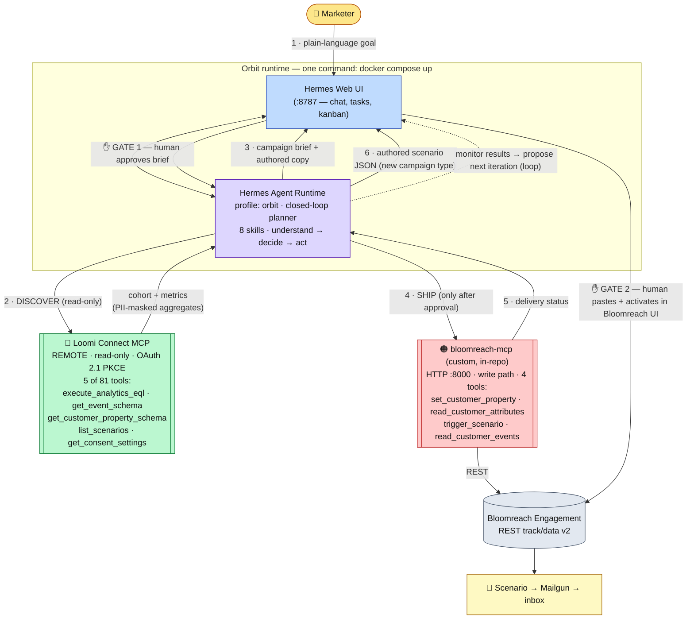

# Architecture

One clear diagram of how Orbit connects to **Loomi Connect MCP** (and the custom write-MCP), with both human-approval gates.

> **To export PNG/PDF for the submission portal:**
> - Paste the Mermaid block below into <https://mermaid.live> → Export PNG/SVG, **or**
> - `cd docs/submission && npx -y @mermaid-js/mermaid-cli -i architecture.md -o architecture.png`

## Legend

| Box | What it is |
|---|---|
| **Marketer** | The human. Gives a goal; approves at both gates. The agent recommends, the human executes. |
| **Hermes Web UI (:8787)** | Chat + scheduled tasks + kanban. The demo surface (the agent can also run on Slack/Teams/Telegram/email). |
| **Hermes Agent Runtime** | The closed-loop planner (Hermes "orbit" profile). Orchestrates both MCPs; carries the 8 Orbit skills. |
| **🔵 Loomi Connect MCP** | Remote, **read-only**, OAuth. The discovery/context surface — 5 focused tools of 81. *This is the central integration.* |
| **🟠 bloomreach-mcp** | Custom in-repo write-MCP (Python/FastMCP). The execution surface — wraps Engagement REST; only acts after Gate 1. |
| **Bloomreach Engagement** | The CRM/automation platform. Scenarios send the email; humans activate new scenarios (Gate 2). |
| **✋ Gate 1 / Gate 2** | The two mandatory human-approval points. Gate 1 = approve the brief before any write/send. Gate 2 = human pastes + activates a new scenario JSON. |

## Flow (numbered on the diagram)

1. Marketer gives a plain-language goal in the UI.
2. Agent **discovers** via Loomi Connect MCP (read-only EQL + schemas + consent) → gets a real cohort + metrics on PII-masked aggregates.
3. Agent authors a **campaign brief + email copy** and presents it.
4. **Gate 1** — human approves; only then the agent **ships** via the custom write-MCP (set properties → verify → trigger scenario).
5. Agent reads back **delivery status**.
6. For a new campaign type, the agent hands over importable **scenario JSON**; **Gate 2** — the human pastes + activates it in Bloomreach. Then the agent monitors results and proposes the next iteration — closing the loop.
